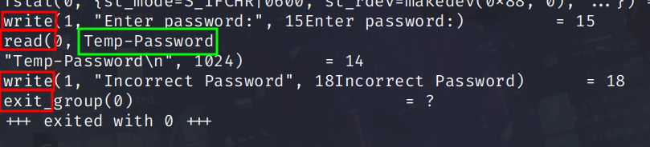
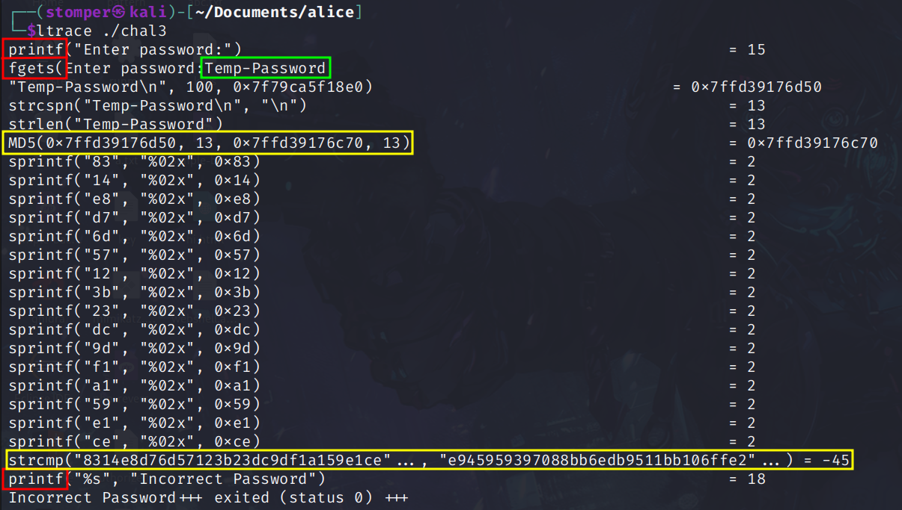
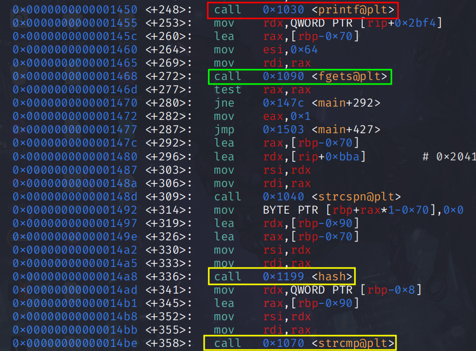
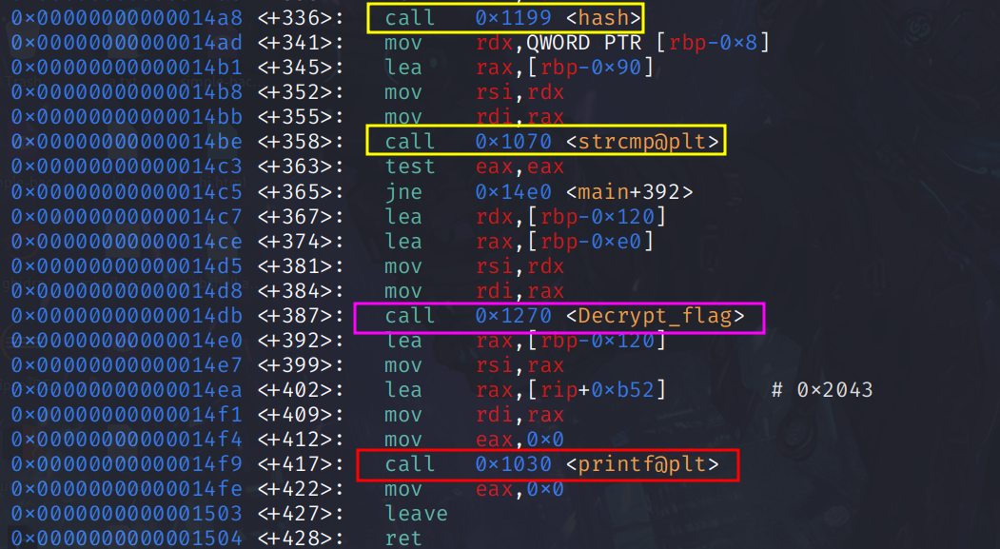
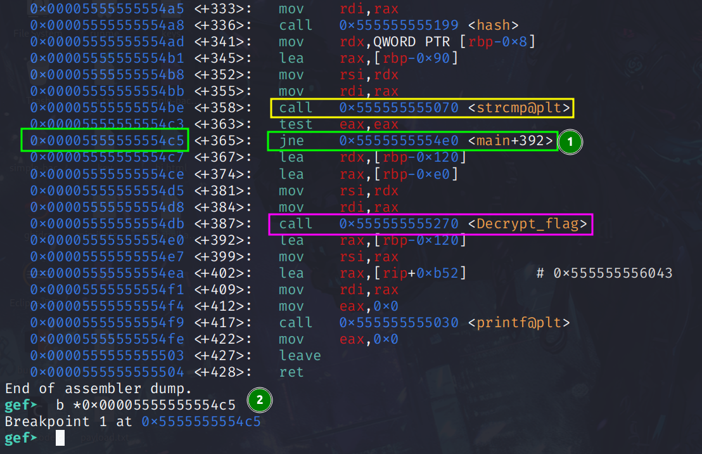
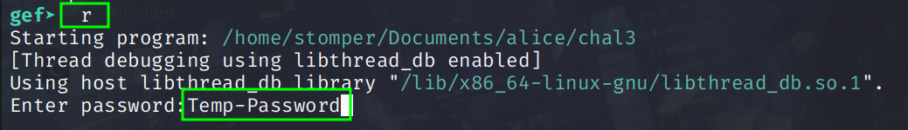
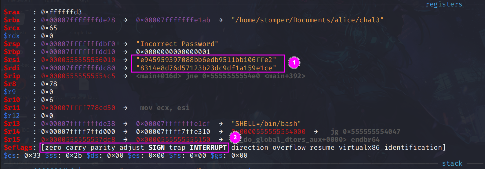
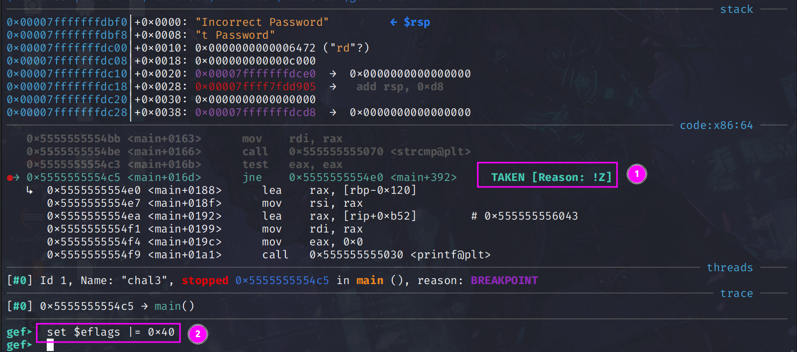
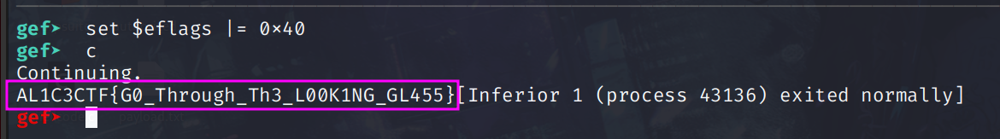

# Walkthrough for CTF Challenge: Caterpillar's Binary 

## Meta

Category:
> Reverse Engineering

Difficulty:
> Medium - Hard

Challenge Text: 
> Congratulations, the twisting mazes of Pwnderland have taken you deep into the rabbit hole. You may be one of the few contestants able to navigate using the obfuscated maps of this treacherous place. You come across the Caterpillar; he might tell you where Alice has gone, but first you must prove yourself…

>He offers you a cryptic binary, its logic twisted like the smoke rings swirling from his hookah. Only by unraveling its secrets can you coax the truth from him. Solve the challenge, and the Caterpillar will reveal your next destination.

Given: 
> chal3 (file)

Hint:
> No hint intended (Both dynamic and static analysis are straightforward, no obfuscation techniques are used.)

Tools demonstrated in this walkthrough: 
> strace
> ltrace
> GDB
> gef


## Steps to Solve

### Step 1: strace

Run the command:
```
strace ./chal3
```

- strace shows a write, read, write and exit. 
- The green box shows input to the program
- No fancy anti-debugger techniques are used

### Step 2: ltrace

Run the command:
```
ltrace ./chal3
```

- The red and green rectangles show the same as in the strace image
- After recieving the input the program creates an **MD5** hash with the given password. 
- The **sprintf** lines convert the binary array (output from the MD5 function in the openssl library) to hex
- **strcmp** compares the password with a hardcoded password hash inside the program

### Step 3: Disassembly with GDB and gef

Install gef with:
```
bash -c "$(wget https://gef.blah.cat/sh -O -)"
```

Run the commands:
```
gdb ./chal3
disas main
```

- The colours show the same as in previous images.
- Main calls Decrypt_flag after the hash and string compare operations

-After these operations there is a function we haven't seen yet to decrypt the flag. It is our goal to run this function. 

### Step 4: Debug with GDB and gef

Run the commands:
```
start
disas main
```
Set a breakpoint at the address which corresponds with the jump command between **strcmp** and **Decrypt_flag**

Command:
```
b *address
```



Run the program and enter the password



- Inputs marked in green


- Stopped at the breakpoint we previously set
- We can see the hashes are not the same so we do not have the correct password
- We can see the zero flag is not set, this will influence our jump. 


- Shows that the jump will be taken because the the zero flag is not set
- If we continue the program it will exit.
- Instead we will set the zero flag manually

Command:
```
set $eflags |= 0x40
```

Continue the program until exit and retrieve the flag


