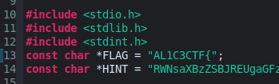

# Walkthrough for CTF Challenge: *Mad Hatter's Message*

## Meta

Category:
> Reverse Engineering

Difficulty:
> Medium/Easy

Challenge Text: 
> The Mad Hatter was developing a program and we think it has a secret message. Unfortunately nobody can make any sense of his code. Give it a look and see if you can get the secret out.

Given: 
> C Source code that has been obfuscated.

Hint:

> *None Provided*

Tools demonstrated in this walkthrough: 
> Eclipse IDE and built in C-code debugger


## Steps to Solve

### Step 0: The Free Hint
At the top of the code there is a global variable named hint. It contains a string in base64.


Decrypting this string displays the hint: `Eclipse IDE has a great built in C debugger`. Eclipse is not the only tool that can be used to solve this challenge, but it will be demonstrated in this walkthrough. To skip static analysis and go straight to debugging, jump to [Step 8](#step-8-debugging).


### Step 1: Setting Up
- Recognize the type of code and change the file type to .c 
Opening a c file in Eclipse enables colouring which helps track functions and variables.


- Build and run the file as is - to check for any errors: 
No errors:

Runs with no errors and no output.


- Separate functions and find main which will be the entrypoint. 


### Step 2: Understanding Main
Fix spacing and rename variables:


Breaking down the code:
```C
if(argc!=6)
{
    exit(1);
}
```
The above snippet exits the code unless it is run with 5 arguments. **This is our first hint!**


```C
int IntArray1[6]={1949512556,1949512556,1949512556,1949512556,1949512556,1949512556};
	
for(int i=1;i<argc;i++)
{
    IntArray1[i-1]=atoi(argv[i]);
}
Fun5(IntArray1);
```

The above snippet creates a character array, and inserts the 5 arguments to the first 5 locations **as integers**. It passes this array to Fun5 (A renamed function from step 1)

### Step 3: Understanding Fun5
Fix spacing and rename variables:


Breaking down the code:
```C
int IntArray2[6];
for(int i=0;i<5;i++)
{
    IntArray2[i]=(IntArray1[i]<<4)|(IntArray1[i]>>28);
}
IntArray2[5]=IntArray1[5];
Fun4(IntArray2);
```

This function: 
- Creates a new character array (IntArray2).
- For the first 5 values in IntArray1:
  - Performs a left bit shift by 4 bits, discarding the highest bits
  - Performs a right bit shift by 28 bits, discarding the lowest bits.
    - This effectively performs a bit rotation for a 32 bit integer. We know IntArray1 has 32 bit integers from the atoi function in main.
  - Saves the values in IntArray2
  - Passes IntArray2 to Fun4

This function appears to be a step to obfuscate the arguments by rotation.
**Arg[i]** rotated left by 4 

### Step 4: Understanding Fun4
Fix spacing and rename variables:


Breaking down the code:

```C
int XorKeys[6] = {392101947,536895068,1197172572,374409022,1148929885,1949512556};
int IntArray3[6];
for (int i=0;i<6;i++)
{
    IntArray3[i]=(IntArray2[i]^XorKeys[i]);
}
```
This Snippet:
- Creates an array of xor keys
- Creates a 3rd integer array
- Xor's the values from IntArray2 with the proper xor key, and saves the new value into IntArray3


```C
if(IntArray3[0]==IntArray3[1]&&IntArray3[1]==IntArray3[2]&&IntArray3[2]==IntArray3[3]&&IntArray3[3]==IntArray3[4]&&IntArray3[4]==IntArray2[5])
{
    if(IntArray3[5] == 0)
    {
```
This snippet:
- Checks whether the first 5 values in IntArray3 are equal to the last value in IntArray2
  - This is the value that wasn't written over by arguments in main (1949512556)
- Checks whether the last value in IntArray3 is equal to 0. 
  - 1949512556 xor 1949512556 = 0


```C
        char *var=&((char *)IntArray2)[20];
        printf("3%.*s_work\n",4,var);
        Fun3(IntArray2);}
	}
}
```
This snippet:
- creates a pointer to a character array
    - the value is the same address as the 20th byte in IntArray2 
- prints 4 bytes of the character pointer within the string.
  - This is a clever way of hiding character strings inside of integers. The binary for the integer `1949512556` and the string `l33t` is identical. 
  - the string printed is `3l33t_work`.
- Passes IntArray2 to Fun3

This function does not modify the data, it passes IntArray2 along unchanged, but it checks the data. **This is our next hint!**
**Arg[i]** ^ **XorKeys[i]** = **1949512556**

### Step 5: Understanding Fun3
Fix spacing and rename variables:


Breaking down the code:
```C
{
	IntArray2[5]=13164;
	Fun2(IntArray2);
}
```
This function replaces the last intege in IntArray 2 (previously l33t) with a hardcoded value.
It then passes IntArray2 to Fun2

### Step 6: Understanding Fun2
Fix spacing and rename variables:


Breaking down the code:
```C
{
	char *CharArray1=(char *)IntArray2;
	Fun1(CharArray1);
}
```
This function creates a character array with the same address as the integer array. It passes the character array to Fun1 

### Step 7: Understanding Fun1

Fix spacing and rename variables:


Breaking down the code:
```C
{
	void Fun1(char *CharArray1);
}
```
This is a function definition, it allows the function to come after the moment when it is called. It is good practice to use function definitions in C, although none have been used so far. 

```C
{
	printf("%s%s}\n",FLAG,CharArray1);
}
```

This prints 2 strings, the first is the FLAG global variable found at the top of the code:

The second is our CharArray1. It ends with a `}`. The format of our print is `AL1C3CTF{CharArray1}`

### Step 8 Debugging

We can solve this challenge by stepping through it with the debugger, and changing the logic when we exit early.

When debugging, our first error/exit is when the code checks if we have 5 arguments:


Lets comment out the code in main where arguments are used and just pass the integer array as created. 


Fun5 rotates the bits in our integer arrays:


Fun4 performs a xor operation and checks our arguments:


This will cause an exit because our integer array is not correct. Lets inspect the logic:
- Currently
  > FlagArrayValue ^ XorKey = leet
- Desired 
  > leet ^ XorKey = FlagArrayValue

Remember IntArray1 in main is filled with `leet` integers. Lets change the logic in main to skip the rotation in Fun5:
New code:


Before:
```C
Fun5(IntArray1);
```
After:
```C
Fun4(IntArray1);
```

This wil build the correct values into IntArray3 in real time, but we cannot make it past the large if statement:


Lets change the if statement and lets pass IntArray3 with the correct arguments to Fun3
New code:


Before:
```C
if(IntArray3[0]==IntArray3[1]&&IntArray3[1]==IntArray3[2]&&IntArray3[2]==IntArray3[3]&&IntArray3[3]==IntArray3[4]&&IntArray3[4]==IntArray2[5])
```
After:
```C
if(1)
```

Before:
```C
Fun3(IntArray2);
```
After:
```C
Fun3(IntArray3);
```

We get the message "3l33t_work"


There are no more errors and we can click the rest of the way through the debugger or resume to get the flag:

