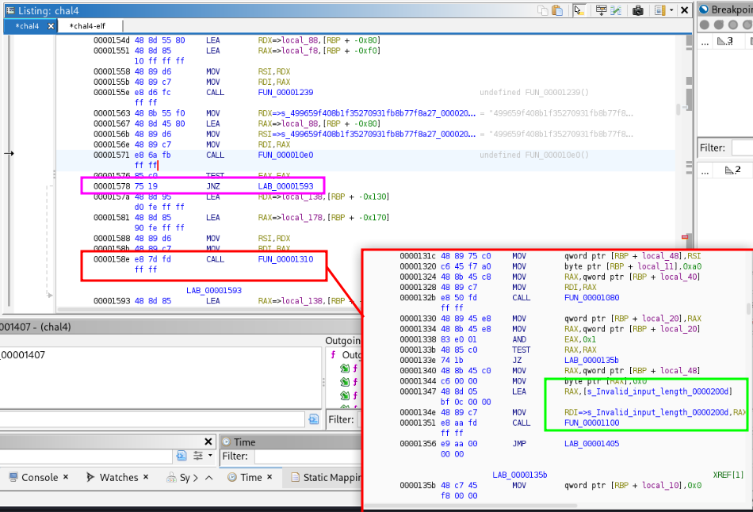

# Walkthrough for CTF Challenge: The Mirror is Broken

## Meta

Category:
> Reverse Engineering

Difficulty:
> Hard - Extreme

Challenge Text: 
> ==gLu9Waz5WZtlGZgUGdh5mclRHbhBycphGdg4WagQnblJXZmZWakBSblV2cgMXZslmZgwSesVGdh5Wd0J3bm5WVg4Cbsl2dgIXdvlHIvRHI5JXYulmYgMXaoRHIn5Wa0NXa3RHI0V3boRXa3BSZwF2YzVGI09mbuF2YgU3bZBiLuV2avJnYgMXagI3byJXatBSZoRFIg4SdvlHIk5WaoVmYgMnclRHdhh2cgQXagwSZuFGbwBCbhNWanFWbgUGa0BCanV3byhGdgUmdv1GI19WegMXYg42bvNHIzFGIsI3byJ3boBic19Weg8GVg4CdpBSZkFWbgUmdhhGI19WW

Given: 
> Chal4r (file)

Hint:
**Expensive Hint**
> If you import an ELF into ghidra it includes function names and other aids to understand it. If you input Raw Bytes into Ghidra you can patch the instructions to change the logic of the executable. 

Tools demonstrated in this walkthrough: 
> CyberChef
> Hexdump
> strace
> ltrace
> Ghidra


## Steps to Solve

### Step 0: Understanding the text

The challenge text is encoded. You can recognize it as base64 except the padding (equals signs) come first. It must be reversed to decode. 

Cyberchef can be used with reverse and from base64:


```
You have made it. To your horror, as soon as you move through the magical plane, it shatters behind you.  The mirror is broken. You cannot escape without twisting this binary to your will. Unfortunately, files seem different in this alternate dimension.
```

### Step 1: Identify the file obfuscation

The file cannot be executed and does not show its type:


Try to identify the file header with hexdump.

Command:
```
hexdump -C -n 32 chal4r
```

- No file header found

Searching for the file header using hexdump, grep, and a list of potential headers:


Searching for reversed headers based on the challenge theme of being reversed:

Command
```
hexdump -C chal4r | grep -iE "fle|zm|ep|kp|fdp|piz|z7|rar|gnp"
```

- File header found at the end of the file, reversed

**Obfuscation method: file is reversed** 

*Shoutout to running strings on the file, it will also show that the file is reversed, however using the file header is an effective way to ensure it is proper when reversed back. If the file is reversed in blocks the header will not be correct*


### Step 2: Reverse the file
Chat GPT wrote a python script to reverse the file:
```py
with open('chal4r, 'rb') as f_in, open('chal4', 'wb') as f_out:
    data = f_in.read()
    f_out.write(data[::-1])
```


Now we can verify the operation was effective by checking the file header or using the file command.

Command:
```
hexdump -C -n 32 char4
file char4
```


Add execute permissions to the file:
```
chmod u+x chal4
```

Execute the file:
 

### Step 3: strace

Run the command:
```
strace ./chal4
```

1) Forks into a child process
2) Child takes user input
3) Parent sleeps for 5 seconds
4) Parent attaches to child (stopping child)
  Exit

To follow the child process run the command:
```
strace -f ./chal4
```

- The colours show the same as in the previous image
1) Confirms that the child process (79655) gets the user input.
2) Confirms that the child process checks whether the password is correct.
- This demonstrates that the anti-debugger technique used is to fork, have the child process handle the logic while the parent sleeps for 5 seconds, then have the parent kill the program. 


### Step 4: ltrace

Run the command:
```
ltrace -f chal4
```


- The colours show the same actions as in previous photos.
- The child process calls the **MD5** function to hash the given password.
- The **sprintf** lines convert the binary array that is returned by MD% to a hex string
- The **strcmp** line appears to compare the given password to a hardcoded password. 
- If the password is incorrect, it prints "Incorrect Password".

### Step 5: Ghidra Analysis
*This program is difficult to debug since it only runs for 5 seconds. Instead of GDB we will use ghidra so that we can analyze and alter the file while it is static.* 


Open the ELF file with Ghidra Debugger, allow ghidra to analyze the file.

Open the Function Call Trees Window to analyze the flow of the program

1) The hash function is shown as well as the functions it calls
2) The string compare function is found, this is the most important function for this program
3) The decrypt flag function is shown, as well as functions it calls. 

Jump to the string compare function call:


 1) Loading the arguments into registers to pass to strcmp.
 2) Calling strcmp which will return 0 if the strings are equal.
 3) Jumping past the Decrypt_flag function in the program if string compare did not return zero.
 4) Load arguments for Decrypt_flag.
 5) Call Decrypt_flag.

### Step 6: Alter logic in Ghidra

In order to patch an instruction (change it to another instruction) We need to import the file as raw binary. (There is a ghidra bug which will cause a segmentation fault if we don't)


The functions are no longer named but you can find the same instructions by locating the string "Invalid_input_length" which is the Decrypt_flag function.  


- The red shows the function that gets called
- The pink shows the jump instruction which we will patch. 


- The pink shows the jump instruction which bypasses the Decrypt_flag function
- The green shows how to patch the instruction after right clicking on the instruction.

We placed 2 NOP commands in place of the jump:


Export as raw bytes:


Now when the file is run, it will print the flag no matter what password is inputted, as long as the parent process doesn't kill it first. 


